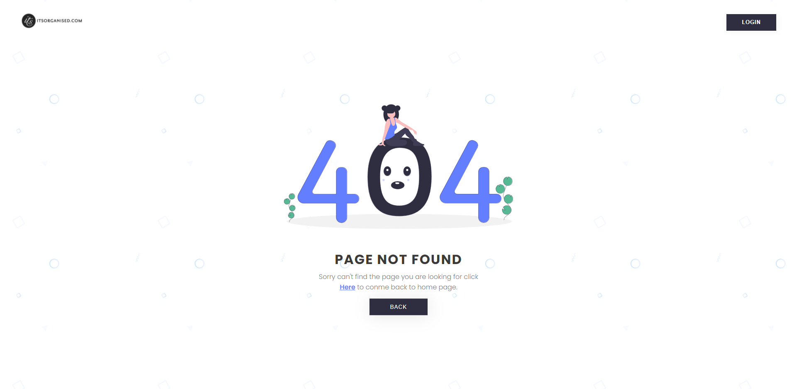

<h1 align="center">
  Page 404
</h1>

  <a href="#open_book-sobre">Sobre</a>
  &nbsp;&nbsp;&nbsp;|&nbsp;&nbsp;&nbsp;
  <a href="#hammer-tecnologias">Tecnologias</a>
  &nbsp;&nbsp;&nbsp;|&nbsp;&nbsp;&nbsp;
  <a href="#rocket-resultado">Resultado</a>

## :open_book: Sobre
Este repositório contêm 1 pagina que mostra uma página de erro 404 responsiva.

## :hammer: Tecnologias
Este projeto foi feito com as seguintes tecnologias:
- HTML5
- CSS3

## :rocket: Resultado

  

 

:computer: Link do tutorial seguido : [Canal no Youtube - Going-To Internet](https://www.youtube.com/watch?v=NItrdXtfrYw)
